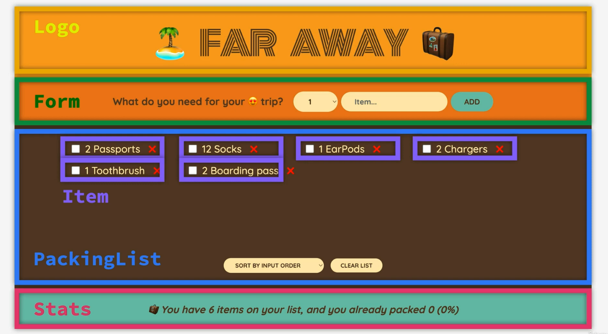
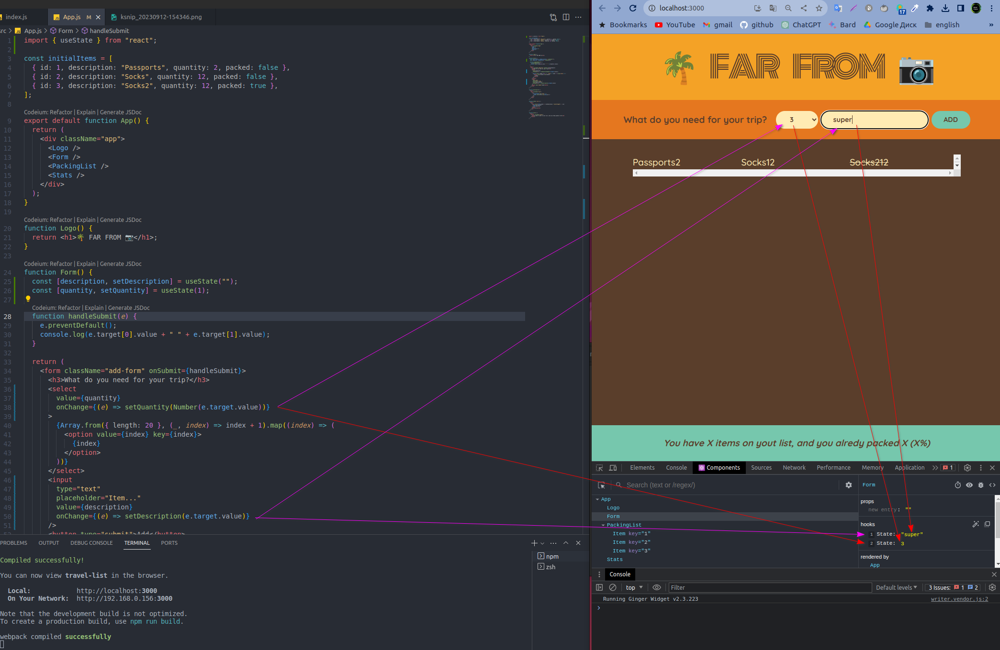
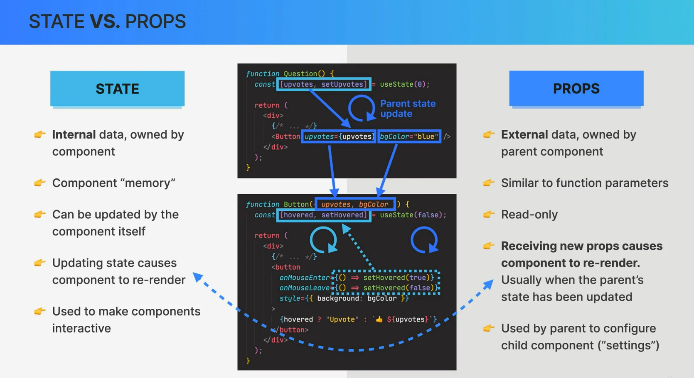
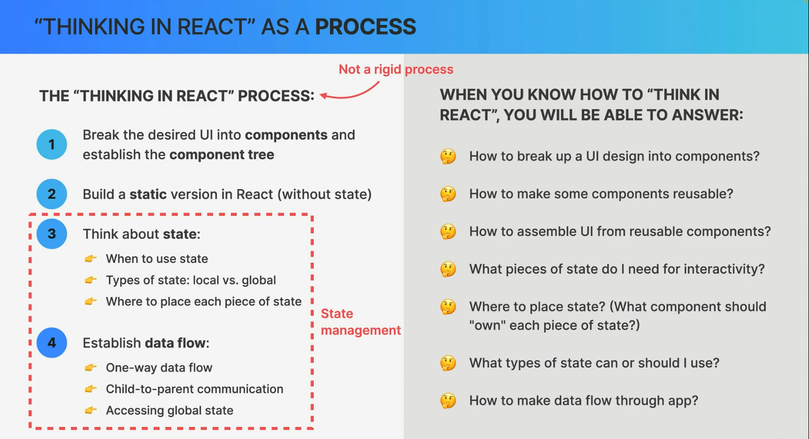
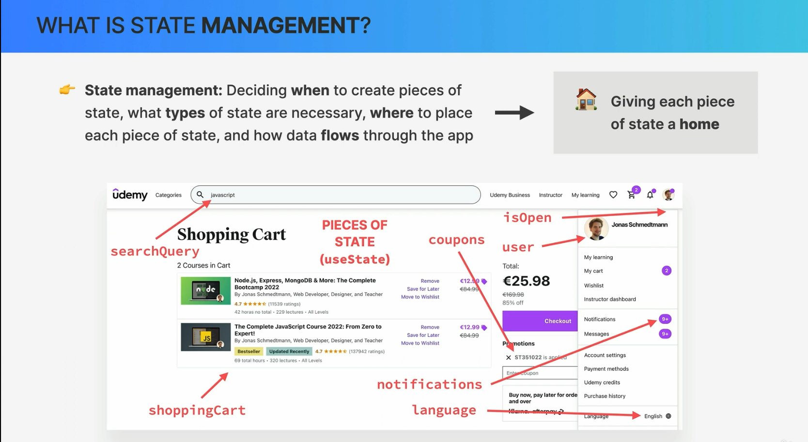
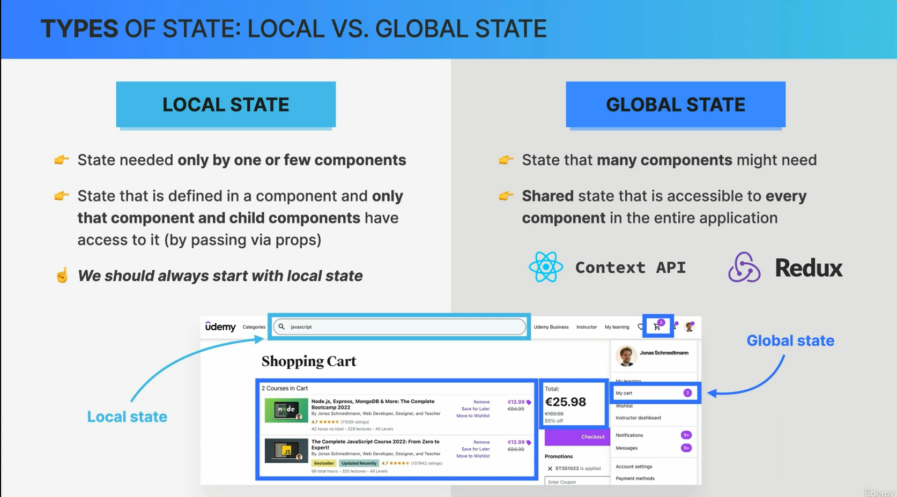
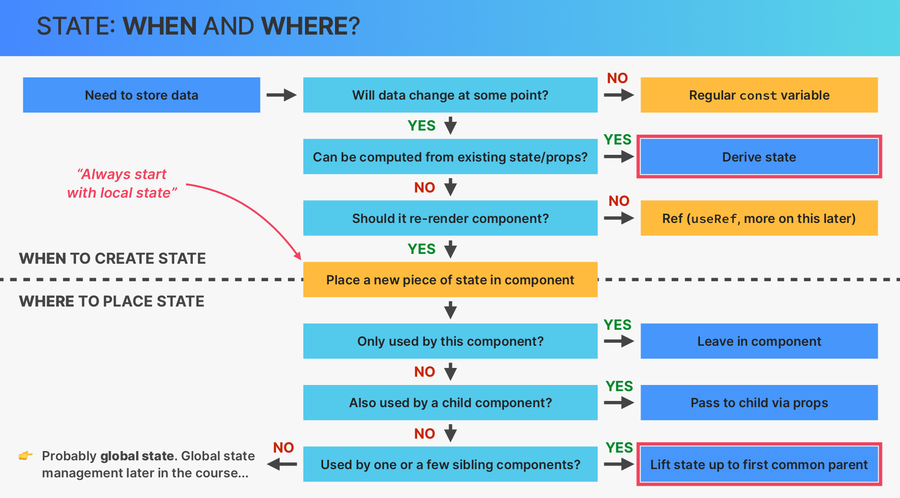
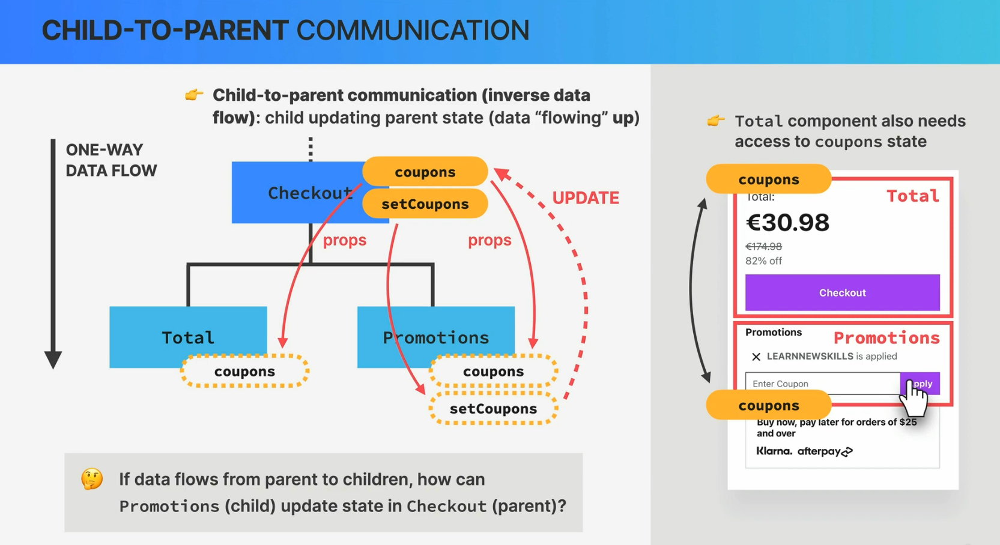
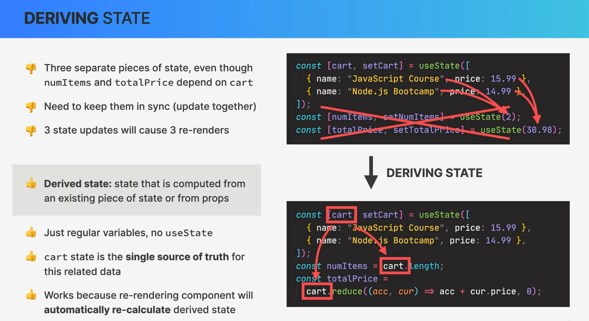

# More about React State:

### State vs Props:

1. **State**: State is a built-in feature in React components that allows you to store and manage data that can change over time. It is mutable and is typically used to store information that the component needs to keep track of during its lifecycle. State can be modified using the `setState` method.

2. **Props (Properties)**: Props are also data that a component receives, but they are immutable and are passed down from parent components. Props are used for passing data from parent to child components and are read-only within the child component.

### State Management:

State management in React is crucial for building complex applications. It involves deciding how and where to store state data, how to update it, and how to ensure that changes in state trigger component re-rendering. You can manage state using React's built-in `useState` hook for functional components or by extending the `React.Component` class with class components.

### Types of State: Local vs Global state:

1. **Local State**: Local state is confined to a single component. It's used when a component needs to manage data that doesn't need to be shared with other components. You typically define local state using the `useState` hook (for functional components) or the `this.state` object (for class components).

2. **Global State**: Global state is used when multiple components need to share and synchronize state data. This can be achieved using state management libraries like Redux, Mobx, or React's Context API. These solutions allow you to maintain a centralized store of data that can be accessed and modified by different parts of your application.

### State: Where and When:

State should be used to store data that affects a component's rendering and behavior. You should set the initial state in the component's constructor (for class components) or within the functional component using the `useState` hook. State changes should be made using the `setState` method (for class components) or the state updater function returned by `useState` (for functional components). State updates trigger component re-renders.

### Sharing State with Sibling Components:

To share state between sibling components in React, you can lift the state up to a common ancestor (typically their parent or a higher-level component). This parent component can hold the state data and pass it down to its children as props. Alternatively, you can use state management libraries like Redux or React Context to achieve state sharing between distant components without the need for prop drilling.

### Lifting State Up:

Lifting state up is a pattern in React where you move the state from a child component to a parent component, making it a shared state that can be passed down to other child components. This pattern is useful when multiple child components need access to the same data or when you want to synchronize state between them.

### Derived State:

Derived state refers to state values that are calculated or derived from other state or props. React components can compute and update derived state based on changes in the primary state or props. Derived state is often used to perform complex calculations, filtering, or transformations of data before rendering it in the component.

Understanding these concepts of React State is essential for building dynamic and interactive user interfaces in React applications. It helps in efficiently managing and updating data within your components, leading to a more responsive and maintainable codebase.

# Getting Started with Create React App

This project was bootstrapped with [Create React App](https://github.com/facebook/create-react-app).

## Available Scripts

In the project directory, you can run:

### `npm start`

Runs the app in the development mode.\
Open [http://localhost:3000](http://localhost:3000) to view it in your browser.

The page will reload when you make changes.\
You may also see any lint errors in the console.

### `npm test`

Launches the test runner in the interactive watch mode.\
See the section about [running tests](https://facebook.github.io/create-react-app/docs/running-tests) for more information.

### `npm run build`

Builds the app for production to the `build` folder.\
It correctly bundles React in production mode and optimizes the build for the best performance.

The build is minified and the filenames include the hashes.\
Your app is ready to be deployed!

See the section about [deployment](https://facebook.github.io/create-react-app/docs/deployment) for more information.

### `npm run eject`

**Note: this is a one-way operation. Once you `eject`, you can't go back!**

If you aren't satisfied with the build tool and configuration choices, you can `eject` at any time. This command will remove the single build dependency from your project.

Instead, it will copy all the configuration files and the transitive dependencies (webpack, Babel, ESLint, etc) right into your project so you have full control over them. All of the commands except `eject` will still work, but they will point to the copied scripts so you can tweak them. At this point you're on your own.

You don't have to ever use `eject`. The curated feature set is suitable for small and middle deployments, and you shouldn't feel obligated to use this feature. However we understand that this tool wouldn't be useful if you couldn't customize it when you are ready for it.

## Learn More

You can learn more in the [Create React App documentation](https://facebook.github.io/create-react-app/docs/getting-started).

To learn React, check out the [React documentation](https://reactjs.org/).

### Code Splitting

This section has moved here: [https://facebook.github.io/create-react-app/docs/code-splitting](https://facebook.github.io/create-react-app/docs/code-splitting)

### Analyzing the Bundle Size

This section has moved here: [https://facebook.github.io/create-react-app/docs/analyzing-the-bundle-size](https://facebook.github.io/create-react-app/docs/analyzing-the-bundle-size)

### Making a Progressive Web App

This section has moved here: [https://facebook.github.io/create-react-app/docs/making-a-progressive-web-app](https://facebook.github.io/create-react-app/docs/making-a-progressive-web-app)

### Advanced Configuration

This section has moved here: [https://facebook.github.io/create-react-app/docs/advanced-configuration](https://facebook.github.io/create-react-app/docs/advanced-configuration)

### Deployment

This section has moved here: [https://facebook.github.io/create-react-app/docs/deployment](https://facebook.github.io/create-react-app/docs/deployment)

### `npm run build` fails to minify

This section has moved here: [https://facebook.github.io/create-react-app/docs/troubleshooting#npm-run-build-fails-to-minify](https://facebook.github.io/create-react-app/docs/troubleshooting#npm-run-build-fails-to-minify)
